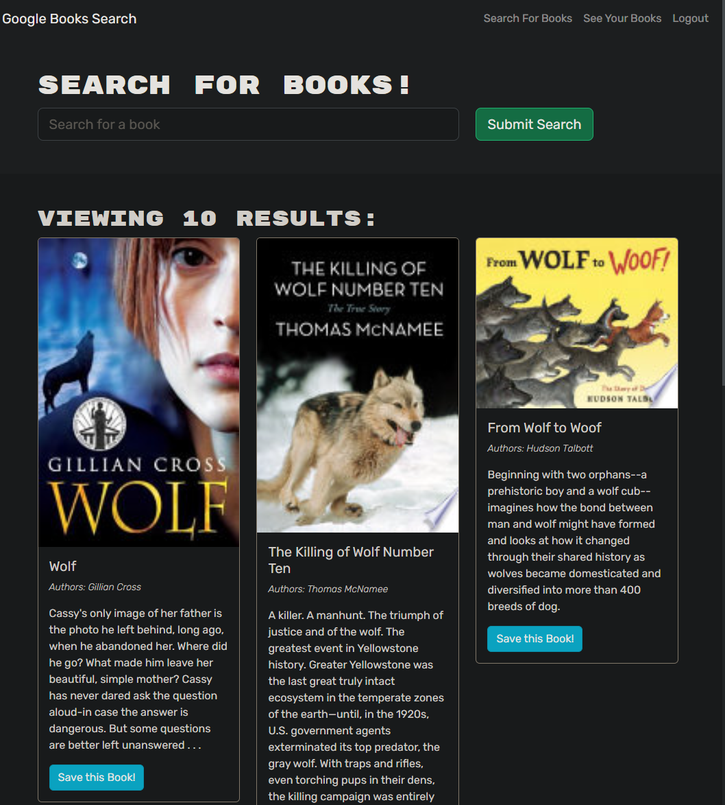

# 21 MERN: Book Search Engine

## Description

The Book Search App is a platform that allows users to search for and save their favorite books.
It allows users to manage a personal book wishlist or "To-Read" list online.

## Installation

Clone the GitHub repository: `https://github.com/lapuzshawn/Book-Search-Engine`

## Usage Instructions

1. Launch the Book Search App.
2. Then users can search for books; also they need to create an account to save books.
3. To create an account, click on the "Login/Sign Up" button.
4. If logged in, user will be redirected to the homepage and they can search for books and save them.
5. To view your saved books, click on the "See Your Books".
6. In the saved books section, users have the option to remove any books. 
7. Log out. 

## Screenshots

--------

## Task

This week, you’ll take starter code with a fully functioning Google Books API search engine built with a RESTful API, and refactor it to be a GraphQL API built with Apollo Server. 

It's already set up to allow users to save book searches to the back end. 

## TO DO
To complete the assignment, you’ll need to do the following:

1. X Set up an Apollo Server to use GraphQL queries and mutations to fetch and modify data, replacing the existing RESTful API.

2. X Modify the existing authentication middleware so that it works in the context of a GraphQL API.

3. X Create an Apollo Provider so that requests can communicate with an Apollo Server.

4. [ O ] Deploy your application to Heroku with a MongoDB database using MongoDB Atlas. Use the [Deploy with Heroku and MongoDB Atlas](https://coding-boot-camp.github.io/full-stack/mongodb/deploy-with-heroku-and-mongodb-atlas) walkthrough for instructions.

